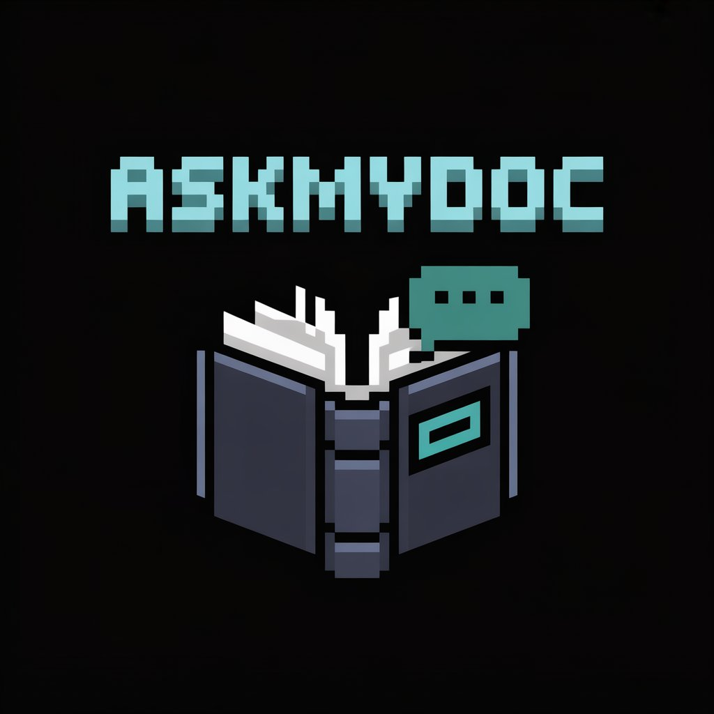

<p align="center">
  
</p>

<h1 align="center">AskMyDoc 🧠</h1>
<p align="center">Chat with your documents using RAG · Groq · LangChain</p>

> Ask questions. Get answers. From any document.


---

## What is AskMyDoc?

AskMyDoc is an AI-powered document intelligence app built on **Retrieval-Augmented Generation (RAG)**. Upload any PDF, ask questions in plain English, and get accurate answers — grounded in your document, not hallucinated.

Built as a learning project to understand how production RAG systems work — the same architecture used in enterprise AI applications.

---

## How It Works

PDF Upload → Chunking → Embeddings → ChromaDB
↓
User Question → Query Embedding → Retrieval → Groq LLM → Answer

1. **Ingest** — PDF is split into overlapping text chunks (size: 1000, overlap: 200)
2. **Embed** — Each chunk is converted to a vector using HuggingFace Sentence Transformers (`all-MiniLM-L6-v2`)
3. **Store** — Vectors + original text stored in ChromaDB (local vector database)
4. **Retrieve** — User query is embedded and top 3 most similar chunks are retrieved via cosine similarity
5. **Generate** — Relevant chunks + question sent to Groq LLM (`llama-3.3-70b-versatile`) → accurate answer

---

## Tech Stack

| Layer | Technology |
|---|---|
| Language | Python 3.11 |
| LLM | Groq API (llama-3.3-70b-versatile) |
| Orchestration | LangChain + LangChain Classic |
| Embeddings | HuggingFace Sentence Transformers |
| Vector DB | ChromaDB |
| API Backend | FastAPI + Pydantic |
| Frontend | Streamlit |
| Version Control | Git + GitHub |

---

## Why Groq instead of Gemini?

Originally built with Google Gemini API. Switched to Groq for:
- **No rate limits** on free tier for development
- **Faster inference** — Groq uses custom LPU hardware
- **Same LangChain integration** — one line change
- `llama-3.3-70b-versatile` performs comparably to Gemini Flash for RAG tasks

---

## Features

- Upload any PDF and query it instantly
- Source-grounded answers with page references — no hallucination
- FastAPI backend with Pydantic request validation
- Clean Streamlit UI with dark Minecraft-inspired theme
- Fully local vector storage with ChromaDB
- Session state management — no duplicate uploads

---

## Project Structure

AskMyDoc/
│
├── app/
│   ├── init.py
│   ├── config.py          # Environment variables and constants
│   ├── embeddings.py      # HuggingFace embedding function with caching
│   ├── rag_pipeline.py    # Core RAG logic — load, chunk, embed, retrieve, generate
│   └── main.py            # FastAPI endpoints — /health, /upload, /ask
│
├── frontend/
│   └── streamlit_app.py   # Streamlit UI
│
├── assets/
│   └── Logo.jpeg          # Project logo
│
├── uploads/               # Temporary PDF storage (gitignored)
├── chroma_db/             # Vector database (gitignored)
├── requirements.txt
├── .env                   # API keys (gitignored)
└── README.md

---

## Getting Started

```bash
# Clone the repo
git clone https://github.com/Shxrvxshar7/AskMyDoc.git
cd AskMyDoc

# Create virtual environment
python -m venv venv
venv\Scripts\activate  # Windows
# source venv/bin/activate  # Mac/Linux

# Install dependencies
pip install -r requirements.txt

# Add your API keys
# Create .env file with:
# GROQ_API_KEY=your_groq_key_here

# Terminal 1 — Start FastAPI backend
uvicorn app.main:app --reload

# Terminal 2 — Start Streamlit frontend
streamlit run frontend/streamlit_app.py
```

Open `http://localhost:8501` in your browser.

---

## API Endpoints

| Method | Endpoint | Description |
|---|---|---|
| GET | `/health` | Check if server is running |
| POST | `/upload` | Upload and index a PDF |
| POST | `/ask` | Ask a question about the document |

Interactive API docs available at `http://localhost:8000/docs`

---

## What I Learned

- How RAG pipelines work end to end
- How embeddings convert text to meaning using vector representations
- How cosine similarity retrieval works in ChromaDB
- How to build a production-style AI backend with FastAPI and Pydantic
- LangChain orchestration — connecting LLM, retriever, and prompt
- Why RAG beats direct LLM calls for private document QA

---

## Roadmap

- [ ] Conversational memory — follow-up questions with context
- [ ] Multi-document support
- [ ] Switch embeddings to FastEmbed for faster inference
- [ ] Cloud deployment (Azure / AWS)
- [ ] Evaluation with RAGAS
- [ ] Agentic search (web + document combined)

---

## Author

**Sharvesh A R**  
SIH'24 National Winner | IEEE Best Paper Award 2026 | GenAI Builder

[](https://www.linkedin.com/in/sharvesh-a-r-932873257/)
[](https://github.com/Shxrvxshar7)

---

> Built to understand. Built to ship. Built to grow.